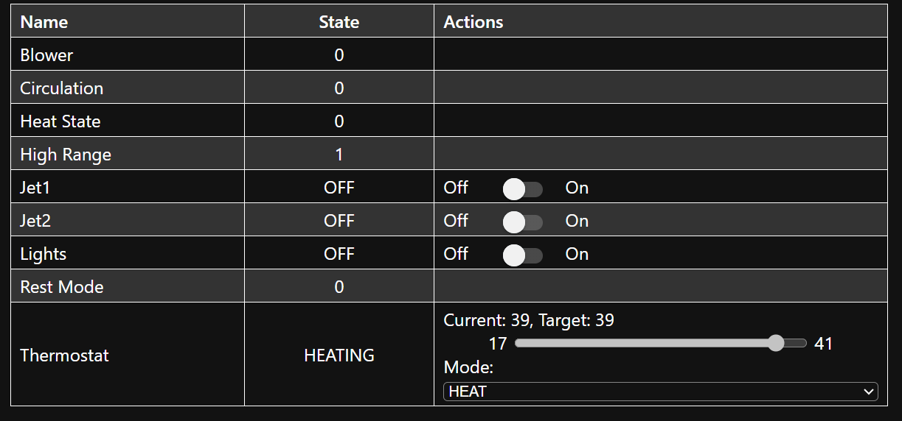
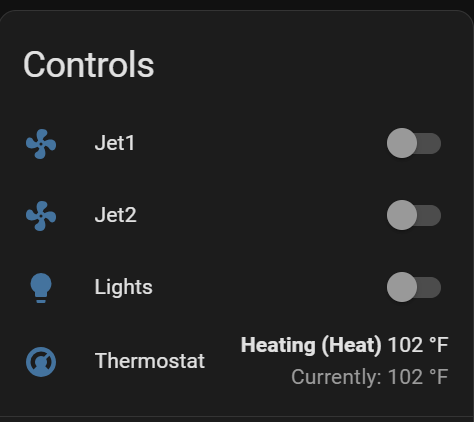

# ESPHome Balboa Spa

An ESPHome external component for Balboa spa controllers, based on prior work from [Dakoriki/ESPHome-Balboa-Spa](https://github.com/Dakoriki/ESPHome-Balboa-Spa), [MHotchin/BalBoaSpa](https://github.com/MHotchin/BalBoaSpa), and [ccutrer/balboa_worldwide_app](https://github.com/ccutrer/balboa_worldwide_app).

This is an extensive rewrite with meaningful structural and functional changes — see [docs/ARCHITECTURE.md](docs/ARCHITECTURE.md) for details.

## Hardware Setup

This component communicates with the spa over RS485, via an ESP32 board and an RS485-to-TTL adapter. For full wiring notes, connector pinouts, and the reasoning behind the parts below, see [docs/HARDWARE.md](docs/HARDWARE.md).

**Recommended hardware:**
- [M5Stack NanoC6](https://shop.m5stack.com/products/m5stack-nanoc6-dev-kit) (ESP32-C6)
- [M5Stack Unit RS485](https://shop.m5stack.com/products/rs485-module) (provides power over Grove connector — no separate power supply needed)
- [M5Stack Grove cable (2m)](https://shop.m5stack.com/products/4pin-buckled-grove-cable)
- [ATX 4-pin Molex MicroFit connector cable](https://www.amazon.com/dp/B07Z6BJCVH) (needed to mate with the spa's `J34`/`J35` connector on some boards — see [docs/HARDWARE.md](docs/HARDWARE.md) for the connector pinout)

**Interference note:** Bundling the ESP and RS485 adapter close together (e.g. taped up) causes significant interference — expect WiFi instability and high CRC error rates. Keeping them separated by the full cable length helps considerably. See [docs/HARDWARE.md](docs/HARDWARE.md) for more information.


*The J34 connector on a Balboa BP6013G2 mainboard. Photo: [koffienl, r/hottub](https://old.reddit.com/r/hottub/comments/1rbvkhu/finally_made_my_tub_smart_full_technical_guide/). See [docs/HARDWARE.md](docs/HARDWARE.md) for the full connector reference.*


## Sample Config

```yaml
esphome:
  name: hottub
  friendly_name: hottub

esp32:
  board: esp32-c6-devkitc-1
  framework:
    type: esp-idf

external_components:
  - source:
      type: git
      url: https://github.com/jhenkens/esphome-balboa-spa
      ref: main

# API and Time required for Sync Spa Time Button.
api:

time:
  - platform: homeassistant

uart:
  id: spa_uart_bus
  tx_pin: GPIO2
  rx_pin: GPIO1
  data_bits: 8
  parity: NONE
  stop_bits: 1
  baud_rate: 115200
  rx_buffer_size: 512

balboa_spa:
  id: spa
  uart_id: spa_uart_bus
  remember_client_id: true
  # client_id: 10  # optional: override the auto-assigned client ID

light:
  - platform: balboa_spa
    balboa_spa_id: spa
    light:
      name: Lights
    light2:
      name: "Lights 2"

# Use switch for simple on/off jets, fan for multi-speed jets
switch:
  - platform: balboa_spa
    balboa_spa_id: spa
    jet1:
      name: Jet 1
      on_level: 2  # optional: target level when turning on (use 2 if your spa's valid states are 0 and 2, skipping 1)
    jet2:
      name: Jet 2
    blower:
      name: Blower
    filter2:
      name: "Filter 2"
    high_range:
      name: High Range
    rest_mode:
      name: Rest Mode

fan:
  - platform: balboa_spa
    balboa_spa_id: spa
    jet_1:
      name: "Jet 1"
    jet_2:
      name: "Jet 2"

climate:
  - platform: balboa_spa
    balboa_spa_id: spa
    name: "Spa Thermostat"
    unit_of_measurement: °F

number:
  - platform: balboa_spa
    balboa_spa_id: spa
    target_temp:
      name: Target Temperature

sensor:
  - platform: balboa_spa
    balboa_spa_id: spa
    current_temp:
      name: Current Temperature
    fault_code:
      name: Fault Code
    fault_total_entries:
      name: Fault Total Entries
    fault_current_entry:
      name: Fault Current Entry
    fault_days_ago:
      name: Fault Days Ago

binary_sensor:
  - platform: balboa_spa
    balboa_spa_id: spa
    connected:
      name: Connected
    heat_state:
      name: Heating
    circulation:
      name: Circulation Pump
    filter1_window_active:
      name: "Filter 1 Window Active"
    filter2_window_active:
      name: "Filter 2 Window Active"
    time_synced:
      name: Time Synced

text:
  - platform: balboa_spa
    balboa_spa_id: spa
    spa_time:
      name: "Set Spa Time"
      mode: TEXT
    filter1_start_time:
      name: "Set Filter 1 Start Time"
      mode: TEXT
    filter1_duration:
      name: "Set Filter 1 Duration"
      mode: TEXT
    filter2_start_time:
      name: "Set Filter 2 Start Time"
      mode: TEXT
    filter2_duration:
      name: "Set Filter 2 Duration"
      mode: TEXT

text_sensor:
  - platform: balboa_spa
    balboa_spa_id: spa
    spa_time:
      name: "Spa Time"
    client_id:
      name: "Client ID"
    filter1_config:
      name: "Filter 1 Config"
    filter2_config:
      name: "Filter 2 Config"
    fault_message:
      name: "Fault Message"
    fault_log_time:
      name: "Fault Log Time"
    reminder:
      name: "Reminder"
    component_version:
      name: "Component Version"

button:
  - platform: balboa_spa
    balboa_spa_id: spa
    sync_time:
      name: "Sync Spa Time"
    reconnect:
      name: "Reconnect"
    disable_filter2:
      name: "Disable Filter 2"
    request_fault_log:
      name: "Request Fault Log"
    clear_reminder:
      name: "Clear Reminder"
```

## Platform Reference

### Climate

The `climate` platform exposes the spa as a thermostat. Mode controls rest mode; preset controls temperature range. If the target temperature is set outside the range of the current preset, the preset will automatically switch to accommodate it.

**Modes and presets:**

| Mode | Preset | Spa State | Description |
|------|--------|-----------|-------------|
| `HEAT` | `Home` | rest_mode=0, highrange=1 | Ready, high range |
| `HEAT` | `Eco` | rest_mode=0, highrange=0 | Ready, standard range |
| `OFF` | — | rest_mode=1 | Sleep/rest mode |

### Water Heater

The `water_heater` platform is an alternative to `climate`, or both can be configured together.

| Mode | Spa State | Description |
|------|-----------|-------------|
| `OFF` | rest_mode=1 | Sleep/rest mode |
| `ECO` | rest_mode=0, highrange=0 | Ready, standard range |
| `Electric` | rest_mode=0, highrange=1 | Ready, high range |

```yaml
water_heater:
  - platform: balboa_spa
    balboa_spa_id: spa
    name: "Spa Water Heater"
```

### `balboa_spa:` Component Options

| Option | Description |
|--------|-------------|
| `id` | Required entity ID for referencing the component in other platforms |
| `uart_id` | ID of the UART bus (use when you have multiple UART buses and need to disambiguate) |
| `client_id` | Override the automatically assigned client ID (integer, optional) |
| `remember_client_id` | Persist the negotiated client ID across reboots so the spa doesn't have to re-assign it (boolean, default: `true`). When a cached ID is used, the component automatically validates it 60 seconds after connecting by toggling light 1 on and off. If the spa doesn't respond, the cached ID is cleared and the component reconnects to negotiate a fresh one. This handles the case where the spa restarts and rejects the old ID. |
| `live_range_refresh` | When enabled, the temperature slider on climate/water_heater entities narrows to the spa's current range (standard or high). When disabled (default), the slider always shows the full spectrum from low-range min to high-range max. Note: Home Assistant does not pick up trait changes at runtime, so the updated range won't be reflected until the device reboots — making this option of limited use. (boolean, default: `false`) |

### Jet Control: Switch vs Fan

**Fan** (recommended for multi-speed jets):
- OFF / LOW / HIGH
- Configured under `fan:` with keys `jet_1`, `jet_2`, etc.

**Switch** (simple on/off):
- OFF / ON (typically LOW speed)
- Configured under `switch:` with keys `jet1`, `jet2`, etc.

Use whichever matches your spa's capabilities.

**`on_level`** (switch only, optional): The target speed level the component will toggle toward when the switch is turned on. The component keeps toggling until this level is reached. Some spas skip level 1 entirely (valid states are 0 and 2 only) — set `on_level: 2` in that case so the component doesn't stop at the intermediate state.

### Writable Switches

The `switch:` platform also exposes two spa mode switches:

| Key | Description |
|-----|-------------|
| `high_range` | Enable/disable high temperature range mode |
| `rest_mode` | Enable/disable rest (sleep) mode |

### Light Control: Light vs Switch

Lights can be exposed via the `light:` or `switch:` platform, or both.

### Binary Sensors

| Key | Description |
|-----|-------------|
| `connected` | Component is actively communicating with the spa |
| `heat_state` | Heater is currently active |
| `circulation` | Circulation pump is running |
| `filter1_window_active` | The current time falls within the filter 1 scheduled window |
| `filter2_window_active` | The current time falls within the filter 2 scheduled window |
| `time_synced` | Spa clock has been synchronised at least once |

Filter window sensors compute state from the current spa time and the configured filter schedule.

### Text Components (Writable)

All text inputs use `H:MM` or `HH:MM` format (24-hour). Invalid formats are rejected with an error log.

| Key | Description |
|-----|-------------|
| `spa_time` | Set spa clock |
| `filter1_start_time` | Filter 1 start time |
| `filter1_duration` | Filter 1 run duration |
| `filter2_start_time` | Filter 2 start time |
| `filter2_duration` | Filter 2 run duration |

Values auto-populate from the spa on startup and stay in sync when changed from the spa panel.

### Filter 2 Switch

Enables/disables the secondary filter cycle. Turning ON requires filter 2 start time and duration to be set via the text components first.

### Numeric Sensors

| Key | Description |
|-----|-------------|
| `current_temp` | Current water temperature. Accepts `unit_of_measurement: °F` — see [Native Fahrenheit support](docs/ARCHITECTURE.md#native-fahrenheit-support) |
| `fault_code` | Raw fault code |
| `fault_total_entries` | Entries in fault log |
| `fault_current_entry` | Current entry index (0–23) |
| `fault_days_ago` | Days since fault |

### Text Sensors (Read-only)

| Key | Description |
|-----|-------------|
| `spa_time` | Current spa time in HH:MM format |
| `filter1_config` | Current filter 1 configuration in JSON format |
| `filter2_config` | Current filter 2 configuration in JSON format (or "disabled") |
| `client_id` | The client ID currently assigned to this component by the spa |
| `fault_message` | Human-readable fault description |
| `fault_log_time` | ISO 8601 timestamp of fault |
| `reminder` | Active maintenance reminder |
| `component_version` | Component version string |

### Buttons

| Key | Description |
|-----|-------------|
| `sync_time` | Synchronise spa clock with ESPHome system time |
| `reconnect` | Drop and re-establish the spa connection |
| `request_fault_log` | Refresh fault data on demand (also fetched automatically on startup) |
| `disable_filter2` | Disable the filter 2 schedule |
| `clear_reminder` | Acknowledge and clear the active maintenance reminder |

### Fault Monitoring

Fault sensors are split across the `sensor:` and `text_sensor:` platforms — see the tables above. The `request_fault_log` button refreshes fault data on demand (also fetched automatically on startup).

<details>
<summary>Fault code table</summary>

| Code | Message |
|------|---------|
| 15 | Sensors are out of sync |
| 16 | The water flow is low |
| 17 | The water flow has failed |
| 18 | The settings have been reset |
| 19 | Priming Mode |
| 20 | The clock has failed |
| 21 | The settings have been reset |
| 22 | Program memory failure |
| 26 | Sensors are out of sync — Call for service |
| 27 | The heater is dry |
| 28 | The heater may be dry |
| 29 | The water is too hot |
| 30 | The heater is too hot |
| 31 | Sensor A Fault |
| 32 | Sensor B Fault |
| 34 | A pump may be stuck on |
| 35 | Hot fault |
| 36 | The GFCI test failed |
| 37 | Standby Mode (Hold Mode) |

</details>

### Reminders

The `reminder` text sensor reports maintenance reminders from the spa: `None`, `Clean Filter`, `Check pH`, `Check Sanitizer`, or `Fault`. Use the `clear_reminder` button to acknowledge and clear the active reminder. Unknown codes show as `Unknown (0x##)` — please [open an issue](https://github.com/jhenkens/esphome-balboa-spa/issues/new) with the code and the message shown on your spa panel.

## Troubleshooting

### CRC Errors

CRC errors are common due to electrical interference from heaters and pumps. Physical separation of the ESP and RS485 adapter helps significantly. If separation alone doesn't resolve it, a missing RS-485 termination resistor may be a contributing factor — see [docs/HARDWARE.md](docs/HARDWARE.md#rs-485-termination-eol-resistor). To silence CRC errors in logs while keeping other debug output:

```yaml
logger:
  level: DEBUG
  logs:
    BalboaSpa.CRC: NONE
```

### UART RX Buffer Size

For ESP-IDF framework, `rx_buffer_size` must be greater than 128 bytes (the hardware FIFO size). Using exactly 128 causes boot loops. Recommended value: **512 bytes**.

```yaml
uart:
  rx_buffer_size: 512
```

### ESP32-S2/S3/C3 with Arduino Framework (ESPHome 2025.10.0+)

If using an S2/S3/C3 board with the Arduino framework on ESPHome 2025.10.0+, add this build flag to avoid `USBSerial not declared` compilation errors:

```yaml
esphome:
  platformio_options:
    board_build.extra_flags:
      - "-DARDUINO_USB_CDC_ON_BOOT=0"
```

Not needed for classic ESP32 boards, ESP-IDF framework, or ESP8266.

## Screenshots

### ESP WebUI


### Home Assistant UI

