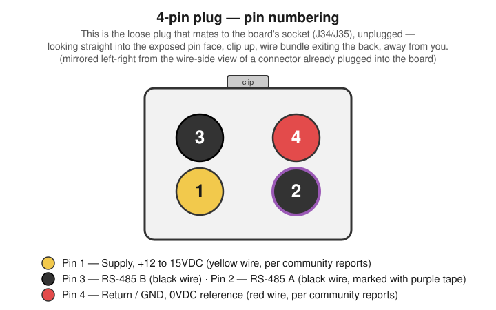
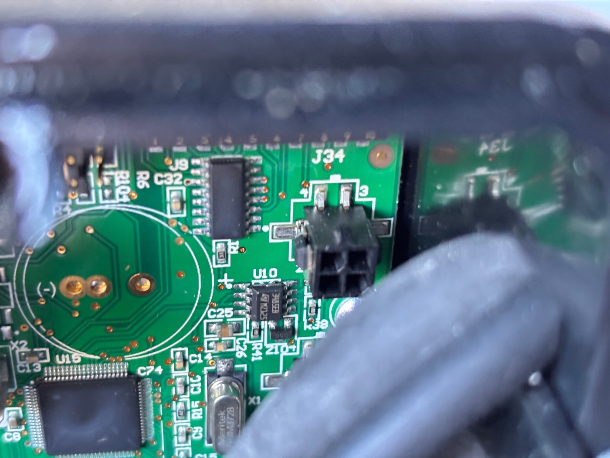
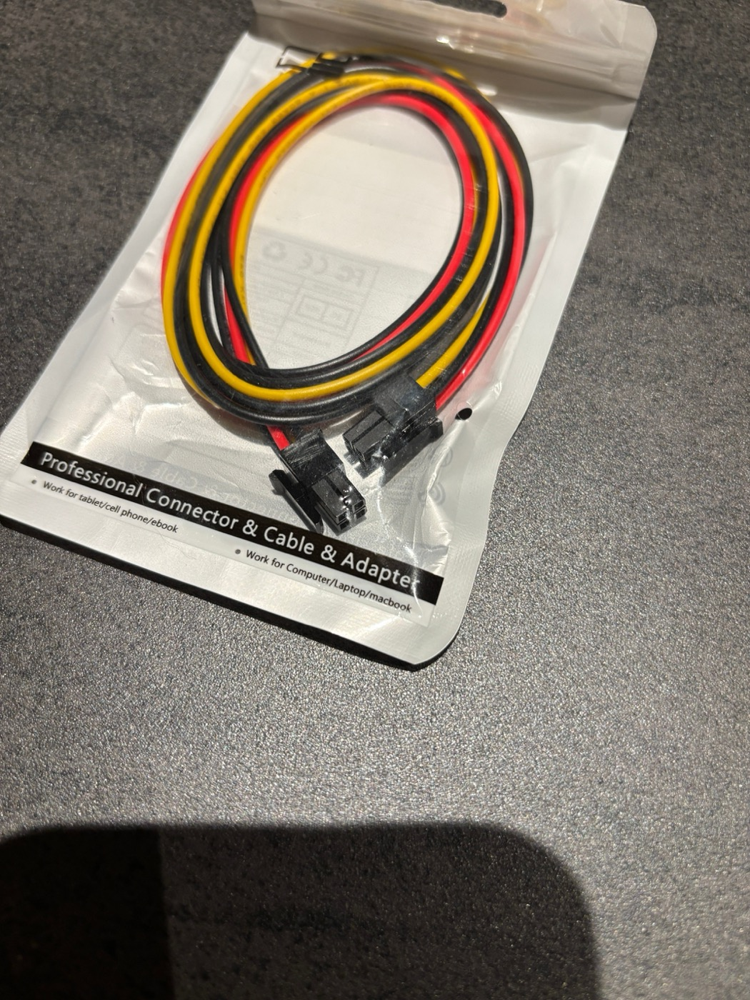
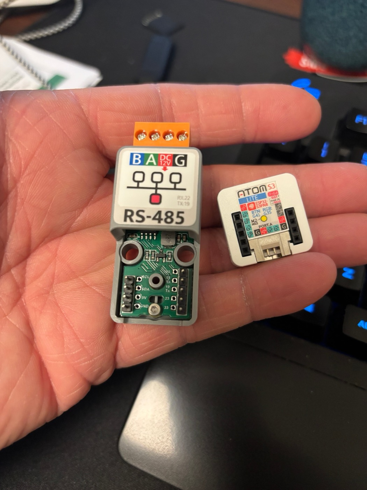
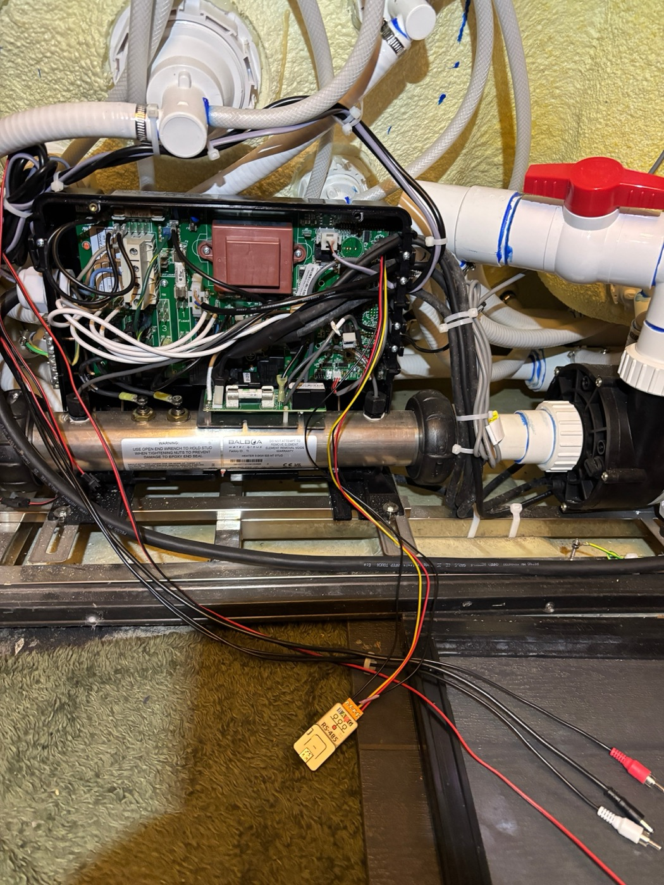

# Hardware Guide

This component talks to the spa over RS485. On most Balboa packs the RS485 bus is exposed on an **M7** connector; on some boards (see [Connector reference](#connector-reference-community-contributed) below) it's labeled **J34**/**J35** instead. Either way, you need an ESP32 board and an RS485-to-TTL adapter wired to it over UART.

## Recommended hardware (current build)

| Part | Notes |
|------|-------|
| [M5Stack NanoC6](https://shop.m5stack.com/products/m5stack-nanoc6-dev-kit) | ESP32-C6 dev board. Small enough to tuck into the spa's rim/skirt. |
| [M5Stack Unit RS485](https://shop.m5stack.com/products/rs485-module) | TTL-to-RS485 converter. Powers the NanoC6 directly over the Grove connector — no separate power supply needed. |
| [M5Stack Grove cable (2m)](https://shop.m5stack.com/products/4pin-buckled-grove-cable) | Connects the Unit RS485 to the NanoC6. Also available in other lengths — see below on why length matters. |
| [ATX 4-pin Molex MicroFit connector cable](https://www.amazon.com/dp/B07Z6BJCVH) | Mates with the spa's `J34`/`J35` connector on boards that use it (see [Connector reference](#connector-reference-community-contributed) below). Old PC power-supply "ATX 4-pin" connectors are a different, larger size and will not fit — buy the correct MicroFit connector rather than salvaging one. |

Just click the NanoC6 and Unit RS485 together via Grove cable — no soldering, resistors, or jumper wires required.

> **Not recommended:** the isolated variant, [M5Stack Unit RS485-ISO](https://shop.m5stack.com/products/isolated-rs485-unit), does *not* provide power over its Grove connector. My first build used the ISO unit plus a generic Amazon 9–24V-to-USB-C adapter to power the NanoC6 separately — it worked, but added a second cable/power-brick to route and mount. Switching to the non-isolated Unit RS485 (which powers the NanoC6 directly) removed that extra part entirely.

## Interference: keep the ESP and RS485 unit apart

Bundling the ESP and RS485 adapter close together (e.g. taped up as one compact unit) causes significant electrical interference — expect WiFi instability and high CRC error rates. Separating them by the full length of the Grove cable dropped both WiFi issues and CRC errors substantially in testing.

Recommended arrangement:
- Mount the **Unit RS485** near the control box — close enough to reach the spa's RS485 connector directly, or via a Y-cable extension if the connector supports it (see below).
- Mount the **NanoC6** several feet away (roughly 5 ft / 1.5 m in my build), e.g. up inside the spa's rim/skirt, connected back to the RS485 unit via the full-length Grove cable.
- Don't shorten the cable run just to tidy up wiring — the physical separation is what fixes the interference, not the cable itself.

## RS-485 termination (EOL resistor)

RS-485 is a multi-drop differential bus. A termination resistor — typically **120Ω**, matching the characteristic impedance of twisted-pair cable — placed across the A/B pair at each end of the bus absorbs the signal instead of letting it reflect back and corrupt subsequent bits. This is a separate concern from the interference/separation issue above, though both show up as the same symptom (CRC errors).

Neither M5Stack RS485 unit in the [Recommended hardware](#recommended-hardware-current-build) table above has a termination resistor built onto the board:

- **Unit RS485** (non-isolated, recommended here) — no resistor included in the box or soldered onto the board, per the [official docs](https://docs.m5stack.com/en/unit/rs485) and package contents listing.
- **Unit RS485-ISO** — also nothing built onto the board, but it does ship with a **loose 120Ω resistor** in the box (per the [official docs](https://docs.m5stack.com/en/unit/iso485)) that you can wire across A/B yourself if needed.

In practice, this bus is short — a few feet from the spa board to the adapter — and works fine for most people with no added resistor, so don't add one pre-emptively. If you're still seeing persistent CRC errors or unreliable communication after ruling out the interference/cable-separation issue above, try wiring a 120Ω resistor across the A and B (data+/data-) terminals at the adapter end as a next troubleshooting step. Only add one resistor to the bus (or one at each end of a long run, not one per device) — over-terminating loads the driver and can make signal quality worse, not better.

## Physical layer (official protocol reference)

The [ccutrer/balboa_worldwide_app wiki — Physical Layer](https://github.com/ccutrer/balboa_worldwide_app/wiki#physical-layer) documents the bus itself, independent of any particular board revision:

> The internal serial bus is RS-485 at 115200 baud, 8 bits per byte, no parity, 1 stop bit (115200/8-N-1). The plug connector is a Molex 430250400 or TE 794617-4 (or equivalent), with the pinout shown below. Wire colors may vary. Connections may be added by connecting to open receptacles on the Main Board, or using Y-splitters. Be sure to keep the wires twisted and/or wrapped to reduce noise injection. It is also recommended to attach pin 3 to the return of the connecting device to reduce common-mode voltage.

| Pin | Signal | Voltage |
|-----|--------|---------|
| 1 | Supply | +12 to 15VDC |
| 2 | RS-485 B (TX+/RX+/D+) | 2 to 3VDC (typically slightly higher than A) |
| 3 | RS-485 A (TX-/RX-/D-) | 2 to 3VDC (typically slightly lower than B) |
| 4 | Return | 0VDC (reference) |

This matches the UART settings already used in the [Sample Config](../README.md#sample-config) (`baud_rate: 115200`, `data_bits: 8`, `parity: NONE`, `stop_bits: 1`).

## Connector reference (community-contributed)

The following was documented by a member of the [r/hottub](https://old.reddit.com/r/hottub/) community for a **Balboa B21 pack** with a **BP6013G2** or **JZ6013X1** board. It may not apply to every Balboa board revision, but is a useful starting point if your connectors are labeled `J34`/`J35`. Many Balboa boards come with a Y-Connector already inline between the board and the control panel — you can use the unused part of that Y-Connector.

- Connector pin numbering (clip at the top, **viewed from the wire side while plugged into the board** — i.e. the wire bundle is coming toward you): `4 - 3` / `2 - 1`.
- Reported wiring, same wire-side view: `DC = pin 1 (yellow)`, `A/B pair = pins 2 & 3 (both black; mark one)`, `G = pin 4 (red)`. This lines up with the official pinout above on pins 1 (supply) and 4 (return), but the community report has `B` on pin 3 and `A` on pin 2 — the reverse of the official table. RS-485 A/B labeling is notoriously inconsistent between manufacturers, so **don't assume either source has your board's A/B assignment right**.
- Power connector: an ATX 4-pin Molex MicroFit — see [Recommended hardware](#recommended-hardware-current-build) above for a link and sizing note.

*Pin numbering on the loose plug (not the board-mounted socket), viewed looking straight into the exposed pin face with the clip up and the wire bundle exiting the back, away from you: pins 3 and 4 on top, 1 and 2 on the bottom. This is the mirror image (left-right) of the wire-side numbering above, since it's the opposite face of the same connector.*

**Before connecting anything:**
1. With the spa pack **powered on**, use a voltmeter to confirm which two pins are actually +VDC (pin 1) and GND/return (pin 4) on your specific board. Don't rely on wire color alone — colors aren't guaranteed consistent across board revisions, and swapping supply and return can damage your adapter.
2. Disconnect power, then wire up and connect your adapter.
3. Restore power and verify it works: if it boots, it's getting power correctly; if it powers on but can't communicate with the spa, try swapping the A/B pair.

*The J34 connector on a Balboa BP6013G2 mainboard. Photo: [koffienl, r/hottub](https://old.reddit.com/r/hottub/comments/1rbvkhu/finally_made_my_tub_smart_full_technical_guide/).*

*An ATX 4-pin Molex MicroFit connector cable, the type needed to mate with J34/J35 — distinct from the larger legacy PC "Molex" connector. Photo: [koffienl, r/hottub](https://old.reddit.com/r/hottub/comments/1rbvkhu/finally_made_my_tub_smart_full_technical_guide/).*

## Further reading

- [ccutrer/balboa_worldwide_app wiki — Physical Layer](https://github.com/ccutrer/balboa_worldwide_app/wiki#physical-layer) — the official RS-485 bus and connector pinout reference quoted above
- [brianfeucht/esphome-balboa-spa](https://github.com/brianfeucht/esphome-balboa-spa) — the actively-maintained ESPHome component this repo is built on
- [Finally made my tub smart — Full technical guide (ESP32 + Balboa + ESPHome)](https://old.reddit.com/r/hottub/comments/1rbvkhu/finally_made_my_tub_smart_full_technical_guide/) — a detailed community write-up (r/hottub) covering an alternative hardware build (M5Stack AtomS3 Lite + Atomic RS485 Base) with wiring photos, plus the comment thread this guide's hardware notes and connector reference are drawn from
- [Original "finally made my tub smart" post](https://old.reddit.com/r/hottub/comments/1qeiis2/finally_made_my_tub_smart/) — the precursor post referenced above

## Pictures

<!-- TODO: add photos of the NanoC6 + Unit RS485 build, the Grove cable routing, and the RS485 unit's connection to the spa pack. -->

*Photos of the NanoC6 + Unit RS485 build described above aren't included here yet.* The photos below are from a **different build** (M5Stack AtomS3 Lite + Atomic RS485 Base) documented in the same [r/hottub community guide](https://old.reddit.com/r/hottub/comments/1rbvkhu/finally_made_my_tub_smart_full_technical_guide/) referenced throughout this page — useful for seeing the general inside-the-control-box layout, but not a match for this repo's recommended parts.

*M5Stack Atomic RS485 Base (left) and AtomS3 Lite (right) — an alternative to this guide's NanoC6 + Unit RS485 combo. Photo: [koffienl, r/hottub](https://old.reddit.com/r/hottub/comments/1rbvkhu/finally_made_my_tub_smart_full_technical_guide/).*

*Inside a Balboa control box with an RS485 adapter wired in near the heater assembly. Photo: [koffienl, r/hottub](https://old.reddit.com/r/hottub/comments/1rbvkhu/finally_made_my_tub_smart_full_technical_guide/).*
